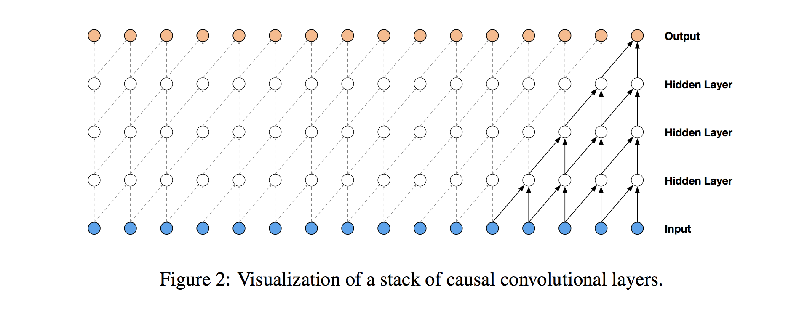
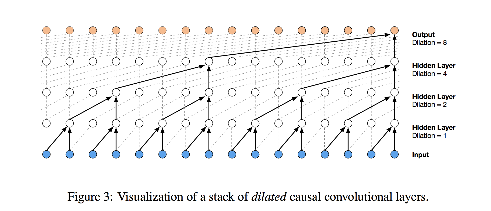

## 来源

> https://github.com/JEddy92/TimeSeries_Seq2Seq/blob/master/notebooks/TS_Seq2Seq_Conv_Full_Exog.ipynb

## 假设

> 145063个样本，时间序列2015-2016一共550天。

|      | Page                                    | 2015-07-01 | 2015-07-02 | 2015-07-03 | 2015-07-04 | 2015-07-05 | 2015-07-06 | 2015-07-07 | 2015-07-08 | 2015-07-09 | ...  | 2016-12-22 | 2016-12-23 | 2016-12-24 | 2016-12-25 | 2016-12-26 | 2016-12-27 | 2016-12-28 | 2016-12-29 | 2016-12-30 | 2016-12-31 |
| :--- | :-------------------------------------- | :--------- | :--------- | :--------- | :--------- | :--------- | :--------- | :--------- | :--------- | :--------- | :--- | :--------- | :--------- | :--------- | :--------- | :--------- | :--------- | :--------- | :--------- | :--------- | :--------- |
| 0    | 2NE1_zh.wikipedia.org_all-access_spider | 18.0       | 11.0       | 5.0        | 13.0       | 14.0       | 9.0        | 9.0        | 22.0       | 26.0       | ...  | 32.0       | 63.0       | 15.0       | 26.0       | 14.0       | 20.0       | 22.0       | 19.0       | 18.0       | 20.0       |
| 1    | 2PM_zh.wikipedia.org_all-access_spider  | 11.0       | 14.0       | 15.0       | 18.0       | 11.0       | 13.0       | 22.0       | 11.0       | 10.0       | ...  | 17.0       | 42.0       | 28.0       | 15.0       | 9.0        | 30.0       | 52.0       | 45.0       | 26.0       | 20.0       |


## 1.时间特征转化

> 找到一些周期性的模式，例如周、月、日、年等。最简单的就是对时间序列编码。

#### 编码：

- 一共550天，提取周的信息。
- 进行one-hot，会得到shape为【550，7】的DF。

|      | 0    | 1    | 2    | 3    | 4    | 5    | 6    |
| :--- | :--- | :--- | :--- | :--- | :--- | :--- | :--- |
| 0    | 0    | 0    | 1    | 0    | 0    | 0    | 0    |
| 1    | 0    | 0    | 0    | 1    | 0    | 0    | 0    |
| 2    | 0    | 0    | 0    | 0    | 1    | 0    | 0    |
| ...  | ...  | ...  | ...  | ...  | ...  | ...  | ...  |

#### 格式化输入：

keras期望输入数组（tensors）的shape【n_samples，n_timesteps，n_features】。

含义：

- 第一个样本是【550，7】的编码，第二个样本跟第一个样本一模一样（数值都一样），因为时间序列一样（共享）。即每个样本共享时间序列。

需要做：

- 以上基础编码。
- 第0维样本维度的扩充。
- 每个样本都是如此编码。

```python
# 在第0位置的维度增加了样本维度，现在是三个维度
dow_array = np.expand_dims(dow_ohe.values, axis=0)
dow_array.shape
### (1, 550, 7)

# 对每一个样本按照上述方式进行编码，得到shap为【n_samples, n_timesteps, n_features】
dow_array = np.tile(dow_array,(df.shape[0],1,1))
dow_array.shape
### (145063, 550, 7)
```


## 2.非时间特征转化

> Page特征拆分成多个特征，one-hot转化

```python
page_df = df['Page'].str.rsplit('_', n=3, expand=True) # split page string and expand to multiple columns 
page_df.columns = ['name','project','access','agent']
page_df.head()
```

|      | name | project          | access     | agent  |
| :--- | :--- | :--------------- | :--------- | :----- |
| 0    | 2NE1 | zh.wikipedia.org | all-access | spider |
| ...  | ...  | ...              | ...        | ...    |

删除name列，对其余的拆分特征列进行one-hot，第0维样本维度的扩充，每个样本都是如此编码。

```python
page_df = page_df.drop('name', axis=1)

page_array = pd.get_dummies(page_df).values
page_array = np.expand_dims(page_array, axis=1) # add timesteps dimension
page_array = np.tile(page_array,(1,dow_array.shape[1],1)) # repeat OHE array along timesteps dimension 
page_array.shape
### (145063, 550, 14)
```


## 3.特征合并

时间特征与费时间特征列合并（列增加）

```python
exog_array = np.concatenate([dow_array, page_array], axis=-1)
exog_array.shape
### (145063, 550, 21)
```

最终，外生（非时间）特征数据格式变成：

```python
##说明：
##1.同一样本内部，只是时间编码特征的不同
##2.不同样本同一时间之间，只是拆分编码特征的不同
##3.第一维是样本量，第二维是时间长度，第三维是特征数量


[   
    # 样1 ###############################################
    [   
        #2015-07-01各特征对应的0-1取值
        [1(周一), 0(周二), ..., 1(project_1), ..., 1(access_1), ..., 1(agent_1), ...], 
        #2015-07-02各特征对应的0-1取值
        [0(周一), 1(周二), ..., 1(project_1), ..., 1(access_1), ..., 1(agent_1), ...], 
        ...
    ],
    
    
    
    # 样2 ###############################################
    [   
        #2015-07-01各特征对应的0-1取值
        [1(周一), 0(周二), ..., 0(project_1), ..., 1(access_1), ..., 0(agent_1), ...], 
        #2015-07-02各特征对应的0-1取值
        [0(周一), 1(周二), ..., 0(project_1), ..., 1(access_1), ..., 0(agent_1), ...], 
        ...
    ],
    
    
    
    ...
]
```


## 4.规范化模型数据

让我们把外源特征数组和内源时间序列数据结合起来，为模型训练和预测做准备。


> 可悲的是，我们不能直接将创建的时间序列数据框和外生数组扔到keras中，让它发挥它的魔力。相反，我们必须再设置几个数据转换步骤来提取准确的numpy数组，然后再传给keras。但即使在这之前，我们还必须知道如何将时间序列适当地划分为编码和预测区间，以达到训练和验证的目的。请注意，对于我们的简单卷积模型，我们不会像这个repo中的第一个笔记本那样使用编码器-解码器架构，但我们将保持 "编码 "和 "解码"（预测）的术语一致---在这种情况下，编码区间代表整个序列的历史，我们将用于网络的特征学习，但不会输出任何预测。
>
> 我们将使用一种前移式验证，即我们的验证集与训练集的时间范围相同，但在时间上进行了前移（在本例中是60天）。这种方式，我们模拟了我们的模型在未来未见的数据上的表现。
>
> Artur Suilin创建了一个非常漂亮的图片，将这种验证风格可视化，并与传统验证进行了对比。我强烈推荐你去看看他的整个repo，因为他在这个数据集上实现了一个真正的最先进的（并且在比赛中获胜的）seq2seq模型。


#### 4.1 训练与验证时间划分：

需要建立4个细分的数据。

1. 训练编码期
2. 训练解码期(训练目标，60天)
3. 验证编码期
4. 验证解码期(验证目标，60天)

新方法与传统方法：

- 新方法：训练集与验证集的预测天数一致（都是A天），只不错验证集相对训练集开始的时间要晚A天。
- 传统方法：将样本划分成训练与预测，训练与验证的时间窗口的起始与结束时间一致。


```python

from datetime import timedelta

pred_steps = 60 
pred_length=timedelta(pred_steps)

first_day = pd.to_datetime(data_start_date) 
last_day = pd.to_datetime(data_end_date)

val_pred_start = last_day - pred_length + timedelta(1)
val_pred_end = last_day

train_pred_start = val_pred_start - pred_length
train_pred_end = val_pred_start - timedelta(days=1)
```

```python

enc_length = train_pred_start - first_day

train_enc_start = first_day
train_enc_end = train_enc_start + enc_length - timedelta(1)

val_enc_start = train_enc_start + pred_length
val_enc_end = val_enc_start + enc_length - timedelta(1)
```

```python
print('Train encoding:', train_enc_start, '-', train_enc_end)
print('Train prediction:', train_pred_start, '-', train_pred_end, '\n')
print('Val encoding:', val_enc_start, '-', val_enc_end)
print('Val prediction:', val_pred_start, '-', val_pred_end)

print('\nEncoding interval:', enc_length.days)
print('Prediction interval:', pred_length.days)

### Train encoding: 2015-07-01 00:00:00 - 2016-09-02 00:00:00
### Train prediction: 2016-09-03 00:00:00 - 2016-11-01 00:00:00 
### 
### Val encoding: 2015-08-30 00:00:00 - 2016-11-01 00:00:00
### Val prediction: 2016-11-02 00:00:00 - 2016-12-31 00:00:00
### 
### Encoding interval: 430
### Prediction interval: 60
```


#### 4.2 Keras数据格式化

上面有了日期划分，下面定义Keras要输入的数据：

- 将时间序列拉到一个数组中，保存一个date_to_index映射，作为引用到数组中的实用程序。

- 创建函数，从所有系列中提取指定的时间间隔。

- 创建函数来变换所有的序列。

  - 在这里，我们通过对log1p进行平滑化，并使用编码器序列平均值对每个序列进行去均值化，然后重塑成keras期望的【n_series（一批的样本量）,  n_timesteps（时间长度）,  n_features（特征数量）】张量格式。
  - 注意，如果我们想生成真实的预测，需要将预测值反向变换即可。

- 利用之前的函数，创建最终函数来提取完整的编码和目标数组。

  - 这将作为一个一次性的函数来抓取我们需要训练或预测的东西。
  - 它将提取（转换的）内生序列（时间序列特征）数据，并将其与我们的外生特征（非时间特征）相结合。

  

下面的第一个代码块完成了前3个步骤，与本系列早期的笔记本没有变化。

```python

date_to_index = pd.Series(index=pd.Index([pd.to_datetime(c) for c in df.columns[1:]]),
                          data=[i for i in range(len(df.columns[1:]))])

series_array = df[df.columns[1:]].values


def get_time_block_series(series_array, date_to_index, start_date, end_date):
    """
    选取所有样本指定时间区内的时间序列数据Y，如销量。
    """
    inds = date_to_index[start_date:end_date]
    return series_array[:,inds]


def transform_series_encode(series_array):
    """
    功能：制造输入Keras的数据格式，用于训练。
    内容：时间序列特征数据，去中心化，平滑，reshape为【n_series,  n_timesteps,  n_features=1】
    参数：
    	series_array：要训练的数据，待编码
    步骤：
    	1.将时间序列销量数组【样本数，时间长度】中每个样本按对应均值去中心化
    	2.同样的方法进行平滑处理
    	3.二维数组reshape【样本数，时间长度，1】
    """
    # nan_to_num：使用0代替数组x中的nan元素，使用有限的数字代替inf元素
    # log1p：log(x+1)
    series_array = np.log1p(np.nan_to_num(series_array)) # filling NaN with 0，平滑序列
    series_mean = series_array.mean(axis=1).reshape(-1,1) # 每个样本求均值，reshape成一列
    # 利用广播将series_array中每个样本序列减去其均值
    series_array = series_array - series_mean 
    # 二位series_array【样本数，时间长度】重新reshape为【样本数，时间长度，1】
    series_array = series_array.reshape((series_array.shape[0],series_array.shape[1], 1))
    
    return series_array, series_mean


def transform_series_decode(series_array, encode_series_mean):
    """
    功能：制造输入Keras的数据格式，用于预测。
    内容：与transform_series_encode()函数一样。
    参数：
    	series_array：要测试的数据，按照训练的编码方式去做，这里换个名字，叫解码序列。
    需要注意：
    	既然是预测，那么预测部分的样本是无法求均值的，此时，用训练（encode）部分样本均值代替。
    """
    # nan_to_num：使用0代替数组x中的nan元素，使用有限的数字代替inf元素
    # log1p：log(x+1)    
    series_array = np.log1p(np.nan_to_num(series_array)) # filling NaN with 0，平滑序列
    series_array = series_array - encode_series_mean
    series_array = series_array.reshape((series_array.shape[0],series_array.shape[1], 1))
    
    return series_array
```

最终，内生（时间序列）特征得到的数据格式：

```python
[   
    # 样1 ###############################################
    [
        [ 时间1的销量 ],
        [ 时间2的销量 ],
        ...
    ],
    
    # 样2 ###############################################
    [
        [ 时间1的销量 ],
        [ 时间2的销量 ],
        ...
    ],
    
    
    ...

]
```


现在，我们可以利用上面建立的前3个处理步骤来创建一个一次性预处理函数，用于提取编码器/输入数据（附加正确的外源特征）和解码器/目标数据。我们将包括参数，让我们选择要提取的时间序列样本数量和从哪个时期采样。写好了这个函数，我们就可以建立模型了!

```python

def get_data_encode_decode(series_array, exog_array, first_n_samples,
                           date_to_index, enc_start, enc_end, pred_start, pred_end):
	"""
	参数：
		series_array: 时间序列特征列，shape【n_series,  n_timesteps,  n_features=1】
		exog_array: 非时间序列特征列，shape【n_series,  n_timesteps,  n_features】
		first_n_samples: 前N个样本
		date_to_index: 日期与index对应数组
		enc_start: 编码开始时间
		enc_end: 编码结束时间
		pred_start: 预测开始时间
		pred_end: 预测结束时间
	
	"""
    # 找到编码开始到预测结束这段时间内的开始与结束日期对应的index
    exog_inds = date_to_index[enc_start:pred_end]
    
    
    ############## Encode部分：规范化输入Keras的训练数据集 ############## 
    # 选取前first_n_samples个样本在【enc_start, to enc_end】时间区内的时间序列特征数据
    encoder_input_data = get_time_block_series(series_array, date_to_index, 
                                               enc_start, enc_end)[:first_n_samples]
    # 将上面选取的时间序列特征数据进行去中心化，平滑，
    # 并reshape为【n_series,  n_timesteps,  n_features=1】
    encoder_input_data, encode_series_mean = transform_series_encode(encoder_input_data)
  

    ############## Decode部分：规范化输入Keras的预测数据集 ############## 
    # 选取前first_n_samples个样本在【pred_start, to pred_end】时间区内的时间序列特征数据
    decoder_target_data = get_time_block_series(series_array, date_to_index, 
                                                pred_start, pred_end)[:first_n_samples]
    # 将上面选取的时间序列特征数据进行去中心化，平滑，
    # 并reshape为【n_series,  n_timesteps,  n_features=1】
    decoder_target_data = transform_series_decode(decoder_target_data,
                                                  encode_series_mean)
    
    
    ############## Encode数据与Decode数据拼接 ############## 
    # we append a lagged history of the target series to the input data, 
    # so that we can train with teacher forcing
    # 训练数据与丢弃最后一天的预测数据拼接，构成训练数据-》预测数据（训练+预测的合并是按照时间顺序排的）
    # 时间上丢弃了考虑区间的最后一天
    lagged_target_history = decoder_target_data[:,:-1,:1]
    encoder_input_data = np.concatenate([encoder_input_data, lagged_target_history],
                                        axis=1)
    
    
    ############## Encode、Decode拼接的数据与非时间序列的外源特征数据拼接  ############## 
    # we add the exogenous features corresponding to day after input series
    # values to the input data (exog should match day we are predicting)
    # 将输入序列值后的天数对应的外生特征即费非时间特征（exog应该与我们预测的天数相匹配）与内生特征即时间特征进行合并，从而构成了Keras的输入数据。
    # 时间上丢弃了考虑区间的第一天
    exog_input_data = exog_array[:first_n_samples,exog_inds,:][:,1:,:]
    encoder_input_data = np.concatenate([encoder_input_data, exog_input_data], axis=-1)
    
    return encoder_input_data, decoder_target_data
```


在图中，想象一下，$y_0,...,y_7$分别是跟随序列值$x_0,...,x_7$的时间步骤的预测输出。有一个明显的问题--既然$x_1$影响输出$y_0$，那么我们就会用未来来预测过去，这就是作弊! 让一个序列的未来影响我们对其过去的解释，这在文本分类这样的背景下是有意义的，因为我们使用已知的序列来预测一个结果，但在我们的时间序列背景下，我们必须在一个序列中产生未来值，而在时间序列背景下就不一样了。

为了解决这个问题，我们调整了我们的卷积设计，明确禁止未来影响过去。换句话说，我们只允许输入连接到未来时间步的输出的因果结构中，如下图所示，在WaveNet论文中的一个可视化的图示。在实践中，这种因果1D结构很容易实现，通过将传统的卷积输出按时间步数移位来实现。Keras通过设置padding = 'causal'来处理。





扩张(因果关系)转折
通过因果卷积，我们有了处理时间流的适当工具，但我们需要额外的修改来正确处理长期依赖关系。在上面的简单因果卷积图中，你可以看到只有最近的5个时间段可以影响到高亮的输出。事实上，我们需要每个时间段增加一层，以达到更远的时间序列（使用适当的术语，增加输出的接受场）。对于一个持续时间超过一年的时间序列来说，使用简单的因果变换来学习整个历史，很快就会使我们的模型在计算和统计上过于复杂。

WaveNet没有犯这样的错误，而是使用了扩张的卷积，它允许接受场作为卷积层数量的函数呈指数级增长。在扩张卷积层中，滤波器不是以简单的顺序方式应用于输入，而是在它们处理的每一个输入之间跳过一个恒定的扩张率输入，如下WaveNet图所示。通过在每个层上以倍数递增的方式（例如1，2，4，8，8，...........）增加扩张率，我们可以实现我们所希望的层数和接收场大小之间的指数关系。在图中，你可以看到我们现在只需要4层就可以将16个输入序列的值全部连接到高亮的输出（比如说第17个时间步长值）。

