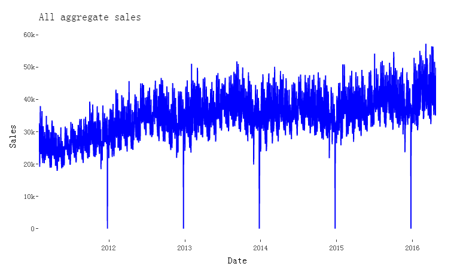
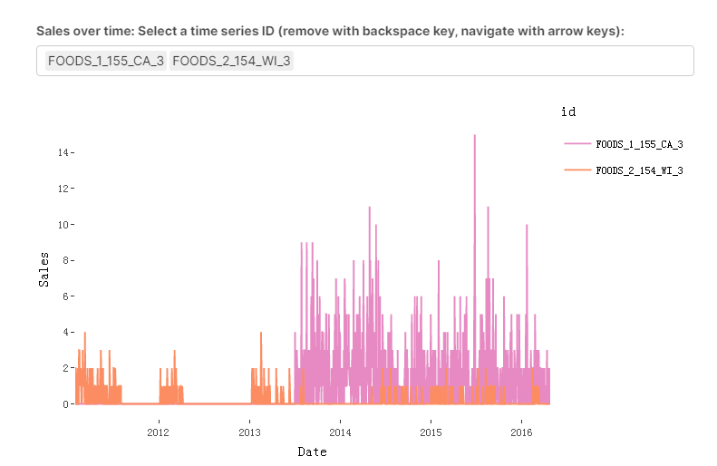
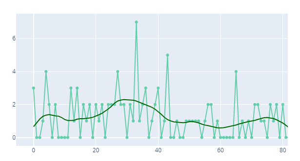
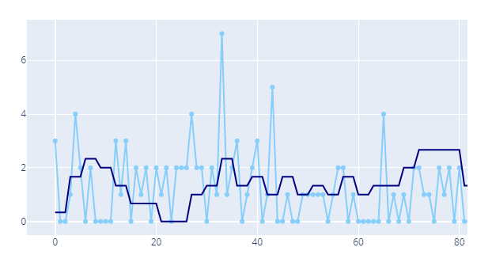
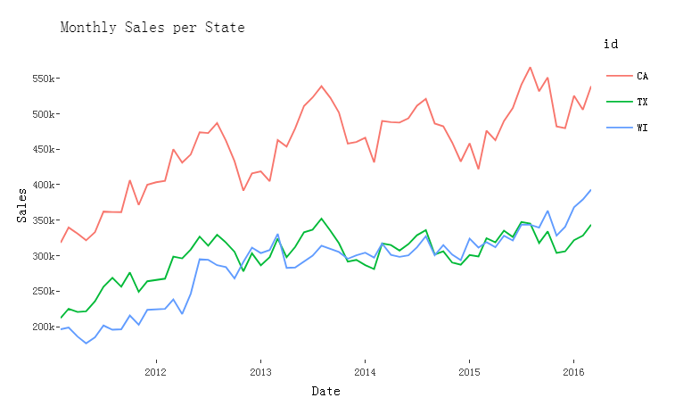
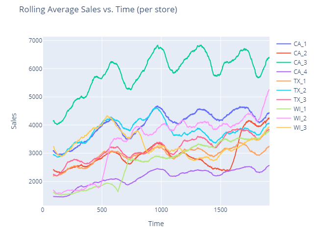
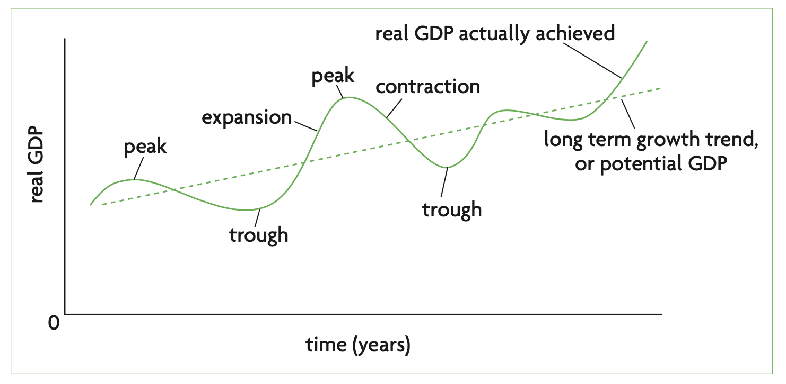

## sales_train_validation.csv

参考：

- Python版本EDA+传统时间序列方法：https://www.kaggle.com/tarunpaparaju/m5-competition-eda-models
  - model：**naive approach, moving average, Holt linear, exponential smoothing, ARIMA, and Prophet**
- R版本EDA：https://www.kaggle.com/headsortails/back-to-predict-the-future-interactive-m5-eda

时间序列预测方法：

- 传统统计学习方法：只用sales_train_validation.csv数据，对每个id的d_系列的销量数据即可。
- 非传统算法：可以结合所有其他csv数据以及构造特征来预测。

### 数据预览：

| id                            | item_id       | dept_id   | cat_id  | store_id | state_id |  d_1 | d_... |
| ----------------------------- | :------------ | :-------- | :------ | :------- | :------- | ---: | ----- |
| HOBBIES_1_001_CA_1_validation | HOBBIES_1_001 | HOBBIES_1 | HOBBIES | CA_1     | CA       |    0 |       |

### 字段关系预览：

```mermaid
graph TD
AA[CSV数据] --> BB[州]
BB --> CC[店铺]
CC --> DD[品类]
DD --> EE[部门]
EE --> FF[具体商品]


A[数据sales_train_validation.csv] --> B1[CA]
A --> B2[TX]
A --> B3[WI]
B1 --> C11[CA_1]
B1 --> C12[CA_2]
B1 --> C13[CA_3]
B1 --> C14[CA_4]
B2 --> C21[TX_1]
B2 --> C22[TX_2]
B2 --> C23[TX_3]
B3 --> C31[WI_1]
B3 --> C32[WI_2]
B3 --> C33[WI_3]
C11 --> D111[HOBBIES]
C11 --> D112[FOOLDS]
C11 --> D113[HOUSEHOLD]
D111 --> E1111[HOBBIES_1]
D111 --> E1112[HOBBIES_2]
D112 --> E1121[FOOLDS_1]
D112 --> E1122[FOOLDS_2]
D112 --> E1123[FOOLDS_3]
D113 --> E1131[HOUSEHOLD_1]
D113 --> E1132[HOUSEHOLD_2]
E1111 --> F11111[HOBBIES_1_001]
E1111 --> F11112[HOBBIES_1_002]
E1111 --> F11113[HOBBIES_1_...]


```

### 商品探索：

##### 1. 整体聚合序列

- 整体聚合销量时间序列。
  - 销售额普遍上升，这对沃尔玛来说是个好消息。我们可以找出一些每年的季节性，在圣诞节下降，这是一年中唯一的商店关闭的日子。
  - Zooming in, we can see strong weekly seasonality plus possibly some additional overlaying patterns with shorter periods than yearly.
  - 最新的 2016 年销售额似乎比往年增长得更快。

##### 2.商品聚合序列

- 日销量为0的太多。

- 商品稀疏性，有些州的商品并不是从开始时间就存在，有些则是断断续续，这是本赛的最大难点之一，怎样去燥等。（如下）

  - 针对不同商品开始出现时间不一，是否可增加新老商品概念。
  - 针对商品周期性销量，是否可增加必需品与非必需品概念。
  - 针对断断续续的商品，？？？实施去噪。
    - **小波去噪：**（通常用于电信号）是一种从时间序列中去除不必要噪声的方法。 这种方法计算称为"小波系数"的系数。 这些系数决定保留哪些信息（信号）和丢弃哪些信息（噪声）。我们利用MAD（平均绝对偏差）值来了解销售中的随机性，并据此确定时间序列中小波系数的最小阈值。 我们从小波中筛选出低系数，并从剩余系数中重建销售数据，仅此而已;我们已经成功地从销售数据中去除了噪声。（参考https://www.kaggle.com/tarunpaparaju/m5-competition-eda-models）（对比见下）
    - **平均平滑：**是去噪时间序列数据的一种相对简单的方法。 在这种方法中，我们采取一个固定大小的"窗口"（如10）。 我们首先将窗口放在时间序列（前十个元素）的开头，并计算该部分的平均值。 我们现在通过特定的"步幅"在时间序列中向前移动窗口，计算新窗口的平均值并重复该过程，直到我们到达时间序列的结束。 然后，我们计算的所有平均值都连接到一个新的时间序列中，形成去噪销售数据。

  

  下图小波去噪示例图，深色线条代表去噪销售，浅线代表原始销售。 我们可以看到，小波去噪能够成功地找到销售数据中的"总趋势"，而不会被噪音分心。 在销售中查找这些高趋势或模式可能有助于生成要素来训练模型。

  

  下图平均平滑示例图，深色线条代表平均平滑法去噪销售，浅线代表原始销售。 我们可以看到，平均平滑在发现数据中的宏观趋势和模式方面不如小波去噪有效。 即使在去噪之后，原始销售中的很多噪音仍然存在。 因此，小波去噪显然更有效地发现销售数据的趋势。 尽管如此，平均平滑或"滚动平均值"也可用于计算建模的有用特征。

  

  

##### 3.州聚合序列

- 加州（CA）销售更多，而威斯康星州（WI）正在慢慢赶上得克萨斯州（TX），并在训练集的最后几个月超过了TX。
- CA 在 2013 年和 2015 年也出现了明显的下降，这些下降似乎也出现在其他州，只是不太严重。这些下降和峰值似乎并不总是发生（见2012年），但它们可能主要反映了我们已经注意到的年度季节性。
- 2012年之后，每年的年中附近销量最高，在此之前销量缓增加，随后销量下降，可能年中有大促之类。
  - 2012年之前无周期性，考虑从2012年之后含有明显周期性开始算？
  - 每个州的销量呈现不同的增长趋势，考虑分开单独训练？

##### 4.州-店铺序列（store_id）

在上图中，我绘制了数据集中所有商店的滚动销售。 几乎每条销售曲线都有宏观层面的"线性振荡"趋势。 基本上，销售振荡像一个正弦波约一定的平均值，但这个平均值有一个线性上升趋势。 这意味着销售每隔几个月就会在越来越高的水平上振荡。

这一趋势让人联想到商业周期，即经济体有短期振荡波动，但长期呈线性增长。 也许，商店层面的这种小规模趋势加起来决定我们在宏观经济层面看到的趋势。 以下是宏观经济商业周期的说明:

### 传统方法

- 不同的州有不同的销售平均值和方差，表明这些州的发展分布差异。

- 大多数销售具有线性趋势正弦波形状，让人联想到宏观经济商业周期。

- 几个非ML模型可用于预测时间序列数据。 移动平均线和指数平滑是非常好的模型。

- ARIMA和Prophet的表现可以通过更多的hyperparamter调整来提升。